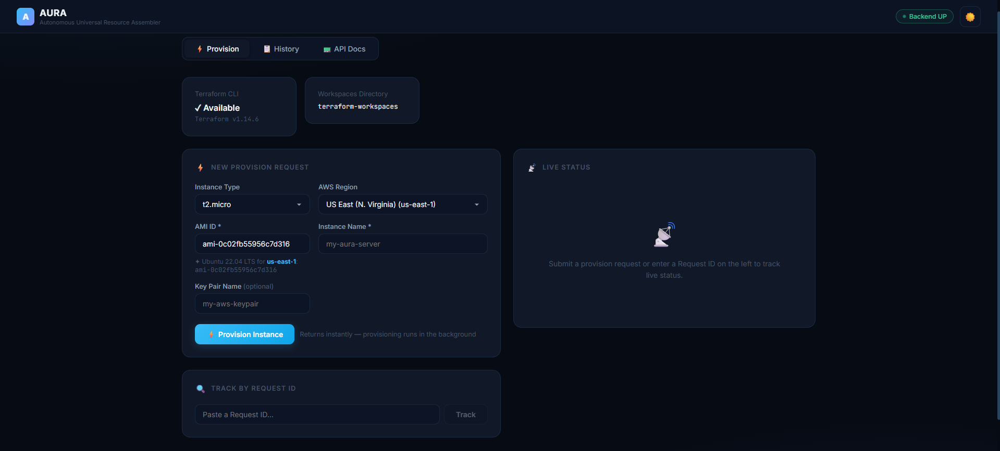

# AURA — Autonomous Universal Resource Assembler

> A self-assembling cloud infrastructure system: submit a REST request, get a running AWS EC2 instance.

[](https://spring.io/projects/spring-boot)
[](https://www.terraform.io/)
[](https://aws.amazon.com/ec2/)
[](https://openjdk.org/projects/jdk/17/)
[](https://opensource.org/licenses/MIT)

---


## What is AURA?

AURA takes a JSON API call and turns it into **real, running infrastructure on AWS or GCP**. Built around a dynamic Strategy Pattern, it automatically generates Terraform configurations on-the-fly, executes `terraform init → plan → apply`, and returns your resource details. It supports provisioning Compute (EC2/GCE), Storage (S3/GCS), and AI Workspaces (SageMaker/Vertex AI). No manual Terraform authoring required.

```
POST /api/infrastructure/provision
{"provider": "AWS", "resourceType": "COMPUTE", "instanceType": "t2.micro", "region": "us-east-1", "amiId": "ami-0c02fb55956c7d316", "instanceName": "my-server"}

──► HTTP 202 + requestId ──► (background) terraform init/plan/apply ──► Resource running in AWS/GCP ✓
```

---

## Prerequisites

| Tool | Version | Check |
|------|---------|-------|
| **Java (JDK)** | 17+ | `java -version` |
| **Maven** | 3.8+ | `mvn -version` |
| **Terraform CLI** | 1.5+ | `terraform version` |
| **AWS CLI** | v2 | `aws --version` |
| **AWS Account** | Active with EC2 access | — |

---

## Credentials Setup

AURA reads credentials from standard cloud provider sources — **never hardcode credentials**.

### AWS Credentials
**Option A — AWS CLI (recommended):**
```bash
aws configure
# Enter: Access Key ID, Secret Access Key, default region
```

**Option B — Environment Variables:**
```bash
export AWS_ACCESS_KEY_ID=your_key_id
export AWS_SECRET_ACCESS_KEY=your_secret_key
export AWS_DEFAULT_REGION=us-east-1
```
*Note: Ensure your IAM user has the necessary permissions (e.g., `ec2:*`, `s3:*`, `sagemaker:*`).*

### GCP Credentials
Install the Google Cloud CLI and authenticate:
```bash
gcloud auth application-default login
```
Or export the service account key via environment variable:
```bash
export GOOGLE_APPLICATION_CREDENTIALS="/path/to/key.json"
```

---

## Build & Run

```bash
# 1. Clone / navigate to project
git clone https://github.com/yourusername/aura-infrastructure-assembler.git
cd aura-infrastructure-assembler

# 2. Build (skip tests for quick start)
mvn package -DskipTests

# 3. Run
mvn spring-boot:run

# OR run the JAR directly
java -jar target/aura-infrastructure-assembler-1.0.0.jar
```

The server starts at **http://localhost:8080**

---

## Web Dashboard




Open your browser at **http://localhost:8080** for the built-in React dashboard.

Features:
- ⚡ **Provision** tab — submit new requests with form validation
- 📋 **History** tab — view all requests, copy instance IDs/IPs, trigger destroy
- 📟 **API Docs** tab — copyable cURL examples for all endpoints
- Live status polling every 5 seconds during active provisioning
- Health badge showing Terraform CLI availability

---

## REST API

### Get Pricing Comparison (Smart Pricing Engine)
Compare costs across AWS and GCP for your requirements:
```bash
curl -X GET "http://localhost:8080/api/pricing/compare?resourceType=COMPUTE&requirements=2cpu_4gb"
```

### Provision a Resource

```bash
curl -X POST http://localhost:8080/api/infrastructure/provision \
  -H "Content-Type: application/json" \
  -d '{
    "provider": "AWS",
    "resourceType": "COMPUTE",
    "instanceType": "t2.micro",
    "region": "us-east-1",
    "amiId": "ami-0c02fb55956c7d316",
    "instanceName": "my-aura-server"
  }'
```

**Response (202 Accepted):**
```json
{
  "requestId": "a1b2c3d4-e5f6-7890-abcd-ef1234567890",
  "status": "PENDING",
  "message": "Request accepted. Poll /status/{requestId} to track progress.",
  "createdAt": "2026-02-28T14:30:00"
}
```

### Poll Provisioning Status

```bash
curl http://localhost:8080/api/infrastructure/status/a1b2c3d4-e5f6-7890-abcd-ef1234567890
```

### Destroy Infrastructure

```bash
curl -X DELETE http://localhost:8080/api/infrastructure/destroy/a1b2c3d4-e5f6-7890-abcd-ef1234567890
```

---

## How It Works (Architecture Flow)

```text
1. POST /provision            → validate → save as PENDING → return 202
2. Background thread          → Use Strategy Pattern to generate .tf files in terraform-workspaces/{id}/
3. terraform init             → download cloud providers (AWS/GCP)
4. terraform plan             → preview changes (logged)
5. terraform apply            → execute deployment to AWS or GCP
6. terraform output -json     → extract metadata (instanceId, publicIp, etc.)
7. Status updated to SUCCESS  → client polls GET /status/{id}
```

---

## Input Validation Rules

| Field | Rule |
|-------|------|
| `provider` | `AWS` or `GCP` |
| `resourceType` | `COMPUTE`, `STORAGE`, or `AI_WORKSPACE` |
| `instanceType` | Valid types like `t2.micro` or `e2-micro` (for COMPUTE) |
| `region` | E.g. `us-east-1`, `us-central1` |
| `instanceName` | 3–64 characters |

*Invalid inputs return HTTP **400** with field-level error details.*

---

## Project Structure

```text
aura-infrastructure-assembler/
├── pom.xml
├── src/main/java/com/aura/infrastructure/
│   ├── controller/     # InfrastructureController, PricingController
│   ├── service/        # Orchestrator, Executor, PricingEngine
│   │   └── strategy/   # Strategy Pattern implementations (AwsComputeGenerator, etc.)
│   ├── model/          # Request, Response, Status, TerraformOutput
│   ├── repository/     # In-memory RequestRepository
│   └── exception/      # Custom exceptions
├── src/main/resources/
│   ├── application.yml
│   └── static/         # index.html (React dashboard)
└── terraform-workspaces/  # Created at runtime per request
```

---

## Configuration (`application.yml`)

| Property | Default | Description |
|----------|---------|-------------|
| `terraform.workspaces-dir` | `terraform-workspaces` | Base path for per-request workspaces |
| `terraform.terraform-path` | `terraform` | Terraform binary name/path |
| `terraform.command-timeout-seconds` | `300` | Max seconds to wait per Terraform command |
| `server.port` | `8080` | HTTP port |

---

## 🚀 Roadmap / Future Enhancements
- [x] **Multi-Cloud Support:** AWS and GCP architectures.
- [x] **New Resource Types:** Compute, Storage, and AI Workspaces.
- [x] **Smart Pricing Engine:** Cost-comparison tool across AWS and GCP.
- [ ] Support provisioning full VPC stacks (Subnets, Security Groups, ALB)
- [ ] Remote Terraform state backend support (S3 + DynamoDB/GCS)
- [ ] Natural Language to IaC processing (AI integration)


---

## License
This project is licensed under the MIT License - see the [LICENSE](LICENSE) file for details.

---
